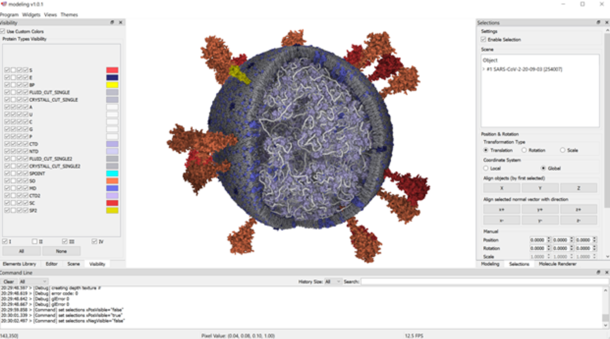
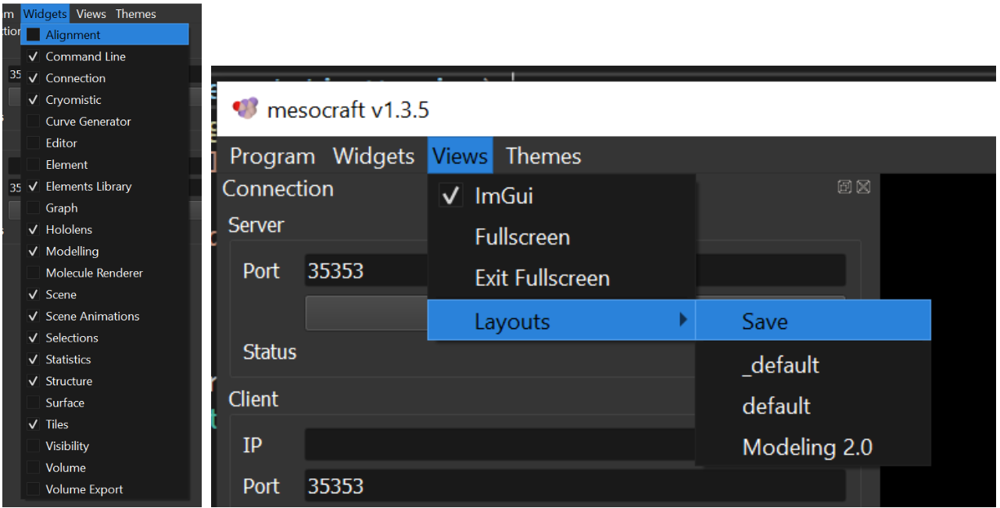
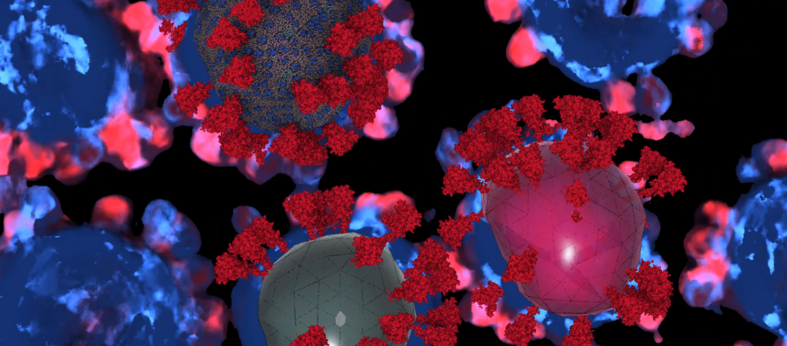

# MesoCraft Environment

Simple visual of the MesoCraft system

The environment is based on the Qt GUI library. Individual windows can be relocated or hidden/shown. The main unit is Ångström (Å).

## Layouts

MesoCraft software functionality is separated into modules. Each module represents a set of functions relevant to the specific domain. These panels are accessible through the Widgets menu item. The user can select which panels are visible. The GUI layout can be stored via Views/Layouts/Save menu action. The layout is automatically stored into /layouts folder with the name representing the current datetime. Layout named default.json is applied automatically after the application starts.

Layouts manipulation can be done through the main menu.

## Manipulation with objects

**Left mouse** button click in the scene to select an object.
Holding **left mouse** button and moving with the mouse rotates the camera.
**Mouse wheel** performs zoom. The amount of zoom can by multiplied by holding Ctrl and/or Shift,
Using the gizmo to move (key **T**)|rotate (key **R**)|scale (key **S**) the object.

## Keyboard Shortcuts

| Key            | Action                                            |
|----------------|---------------------------------------------------|
| R              | Switches gizmo tool into Rotation mode            |
| S              | Switches gizmo tool into Scale mode               |
| T              | Switches gizmo tool into Translation mode         |
| O              | Rotates selected protein into default orientation |

## Multi-modalities rendering

MesoCraft can combine a scene with multiple modalities. Currently these are: 
- Protein data (protein models obtained as PDBs)
- Volumetric data (3D volumetric reconstruction)
- Mesh data (triangle meshes)

Several modalities can be combined in view. In this image, volumetric data is overlaid by mesh and atomistic models.

## Input/Output

### Program->Save Model

Exports the current content of the scene into TXT file, where on every row one element instance is stored. No rules are exported. This model can be loaded using **Program->Load Model** function. For correct loading of the stored model all the protein instances that the model contains have to be in the library.

### Program->Export->Rules
Exports into selected directory rules currently presented in the scene in the form of .json files. These files after copying into `work/data/modeling/models` folder can be after program restart used.

### Program->Load Model
Loads previously stored model using **Program->Save Model**.

### Program->Export->Protein Colors
Exports the currently set color scheme. For more details, see **Visibility** section.

### Program->Import->Protein Colors
Load the previously stored color scheme from the file.
