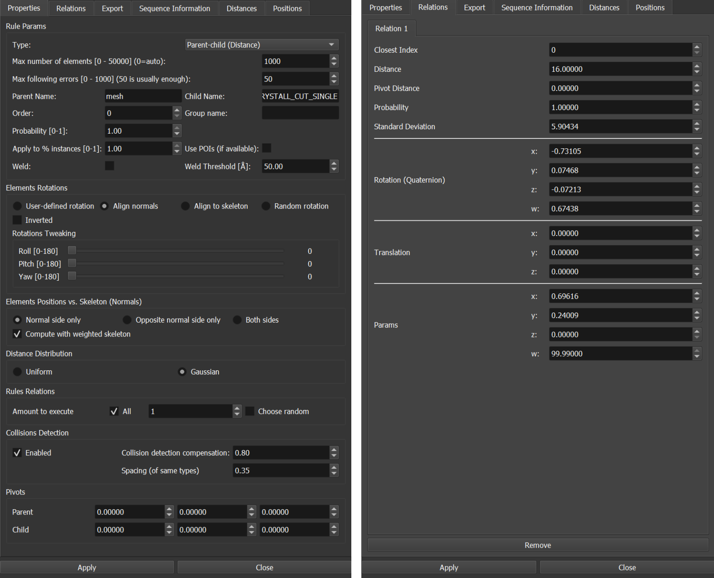

# Modeling

## Building Blocks

### Protein instances (in the form of PDB files)


Protein models used for modelling Covid-19.

### Skeletons


Auxiliary geometric objects used for modelling atomistic models.

### Skeletal Model (set of elements generated by a rule)


Simple atomistic model combining a skeleton and protein models.

## Elements Library


Element Library panel.

### Add elements into the scene

**Ingredients/Add** – add the selected ingredient into the scene. Ingredients can be added/removed to/from the library.

**Models/Add Model** – adds selected model (including rules) into the scene. All models (*.json) files that are presented in `data/modeling/models` directory are listed. This models can be create using **Save Rules** option from the main menu.

**Models/Add Rules** - loads only rules from the given file. It does not create any model.
Skeletons/Add – adds the selected skeleton into the scene. Only presented skeletons are implemented.

**Skeletons/Replace** – replaces the skeleton of the selected model with the selected skeleton.

**Create Skeleton From Mesh** - create a skeleton from selected triangle mesh model

**CustomTriangleSkeleton loads OBJ mesh from work/data/models/model.obj file.

### Add elements into the library

In the bottom part of the *Elements Library* panel.

**Add Ingredient** opens a dialog where the user can select one protein file (PDB, mmCIF, …). After the confirmation the item is added into the library. 

?> :exclamation: **Important!** After adding an ingredient, the software needs to be restarted in order to rebuild internal data structure. Several ingredients can be added within one session. The software can be restarted only once after the all desired ingredients are added.

**Remove Ingredient** removes the selected ingredient from the library. Restart is required in order to update cache file.

The elements can be added manually by modifying library (`modeling-elements-library.json`) file in `work/data/modeling` directory. Every time the library is updated, cache file (`work/data/modeling/cache-file/ingredients-cache.bin`) has to be deleted and the software needs to be restarted. The cache file is created automatically during the start up.

Add Model opens a dialog where the user can select previously exported rules (.json files). These will be listed in the *Models* combobox. The software restart is not required. 

Alternatively, the rule files can be manually copied into `work/data/modeling/models` directory (restart is required).

**Remove Model** removes the selected rule from the Model combobox. No restart is required.

?> **Notice!** When importing a rule, the user has to be sure that the elements used in the rule are available in the Ingredients library. Otherwise, the rule will not work!

## Replacing the skeleton

In several cases it is easier to prepare rules on a single triangle skeleton. Once these rules are ready, the triangular skeleton can be for example replaced by CustomTriangleMesh skeleton. These rules are then applied on every triangle of the mesh. In order to perform this action, a skeletal model has to be selected. In the next step, the target skeleton is select

**Revert** – reverts all elements created by the selected rule from the scene.

**Edit** – opens rule edit dialog where all the parameters related to the rule can be set (see Rule Settings section).

**Remove** – removes the rule from the scene (performs Revert first).

**Selected to Up** – rotates the selected object so their normal vector is oriented in the up direction.

**Set Normal** – The instance is rotated in the way that direction up will be the new normal vector. Then, clicking Set Normal button updates the normal vector of the selected instance within the library.

**Set Bounding Sphere** – every instance can have customized bounding sphere. This bounding sphere can be made visible in the Scene menu. Once bounding spheres are visible, the gizmo updates this bounding sphere. Using the mouse the position can be changed and using -/+ keys it’s size can be updated.

## Library Files Structure

The library combines several files that store various information. This section provides the overview about the structure of the files and where different information is stored.

`\data\modeling\pdb` - Folder from where PDB files are loaded.

`\data\modeling\cache-files` - Cached loaded PDB files for speeding up the loading process. These files are being generated automatically once they are not presented.

`\data\modeling-elements-library.json` - The main library file that specifies which model libraries are available in the system and which should be loaded. Its structure looks as follows. In this case, only elements from library-covid would be loaded.

```json
[
    {
        "libraries": [
            {
                "load": true,
                "path": "library-covid.json"
            },
            {
                "load": false,
                "path": "library-t4.json"
            }
        ]
    }
]
```

`\data\library-covid.json` (and similar names) - Contains actual information regarding PDB protein elements stored in the library.

```json
{
        "boundingSphere": { … },
        "bvh": null,
        "color": { ... },
        "colorHCL": { … },
        "hetatm": false,
        "label": "Spike protein",
        "name": "S",
        "path": "",
        "rotation": { … },
        "source": {
            "pdb": "s",
            "transform": {
                "center": true
            }
        },
        "type": "Protein"
    }
```


## Protein Instance Element

Several protein models can be inserted into the Elements Library. Most typically, they come in the form of a PDB file. However, there is no common rule how the protein captured inside these files should be rotated. MesoCraft offers the possibility to store customised default orientation through the *Element* panel *Store Orientation* button. 

Moreover, the system needs collision objects to be assigned to every protein so it can perform collision queries effectively. Comparing collisions on the atomistic level would be the most precise, however, at the same time the most memory and computationally demanding. Therefore the system allows the user to use either default collision object (a sphere) or a custom collision bounding volume hierarchy (BVH). This hierarchy, once designed, is stored inside the elements library using the *Store Bounding Hierarchy* button.


Left - Element panel; Middle: Default collision sphere object associated with the protein model; Right: Custom bounding hierarchy.

### Designing a BVH

Typically, the hierarchy should consist of 2-3 levels. In general, the fewer objects, the faster is the collision computation. Based on the overall shape of the protein, the first level should be a box or a sphere. The lower BVH levels can be made only with spheres (sphere collision is simpler than a box collision).

To create a new hierarchy, select a protein in the scene and check the *Update* checkbox in the BVH groupbox. Using the Add Level button, the system creates the initial level. New objects can be added to the level after it is selected in the list (using *Add Sphere*, *Add Box*). Alternatively, objects can be removed after its selection using *Remove Object*. Every object after selecting can be moved, rotated and resized directly in the rendering window.
Repeating the process, the user can design a multi-level hierarchy. To end the process of designing BVH, uncheck the *Update* checkbox.


Simple BVH structures with two levels. Selecting a collision object in the list view activates the respective object in the rendering window.

## Rules Settings



Rules Settings dialog window provides the user with the possibility to customise several various parameters of the rule.

These forms are to be able to update the settings of every rule. Based on the type of the rule, only selected parameters can influence the resulting model. For more details please see the paper.

### Properties tabpage

**Max number of elements** – maximum number of elements that can be created by this rule.

**Max following errors** – the algorithm is stopped after this specified amount of consecutive errors (collisions) is generated.

**Parent name** - string name of a parent element to which the rule is applied

**Child name** - string name of a child element to which the rule is applied

**Group name** – customizable string that specifies the group name into this rule belongs to.

**Order** - numerical value that is used to sort rules inside the same group (lower number has priority)

**Probability** – the probability of selecting this rule once applying the rules in the same group.

**Apply to % instances** - to how much percent of instances (parent elements) the rule should be applied

**Use POIs** - points of interest are used for placing the elements

**Weld** - welding of newly generated elements is enabled. Welding means that if a new element is placed within the Welding Threshold, the previously placed element is taken as the result of the rule application. [currently works only with Parent-Child relative rule]

**Weld Threshold** - a threshold used by the welding

**Elements rotation** – type of rotation applied on the newly generated element in the scene. For more info, see ***Elements rotation*** subsection.

**Elements positions vs. Skeleton** – where the element is about to be placed with the respect to the skeleton.

**Compute with weighted skeleton** – if the rule is applied on triangular mesh with triangles evaluated by different probabilities, this probability is taken into account.

**Distance Distribution** – type of distance distribution used

**Rules relations** – typically sibling rule. How many relations from the set of defined relations will be applied.

**Collision detection** – whether collision detection is enabled

**Collision detection compensation** – the ratio that is applied to the bounding sphere to allow overlapping.

**Pivots** - can be used to specify relative points of the element. The position and distance are then taken relatively to this pivot.

### Relations window

**Closest index** – the closest index of the skeleton when the relation was created (parent-child rule)

**Distance** – distance to the skeleton the relation was created (parent-child rule)

**Pivot distance** – distance to the closest point belonging to the skeleton

**Probability** – probability to select this relation when only a subset of all relations is selected

**Standard Deviation** – allowed standard deviation for the distance

**Rotation** – stored rotation of the element

**Translation** – stored translation of the element

### Export tabpage

### Sequence Information tabpage

**Sequence information** – specific item for creating RNA. (description: TBD)ed in the menu and the button **Replace** is clicked.

### Distances tabpage

Allows to specify a distance distribution. For more info see ***Parent-child distant rule/Distances***.

### Positions tabpage

Allows to specify distribution of positions.

Allows to specify a distance distribution. For more info see ***Parent-child distant rule/Angle distribution***.


### Elements rotation

Once a position of the newly generated element is estimated, the rotation is computed. This computation can be modified by four different criteria:

1) **User-defined rotation** – all instances have the same rotation as the template instances (highlighted).

    

2) **Random rotation** – all instances have random rotation.

    
 
3) **Align to skeleton** –normal vector of an instance is aligned with the direction into the skeleton.

    

4) **Align normals** – normal vector of all instances is aligned with the normal vector of the skeleton.

    
 

## Rules Creation


**Rules types** – which rule type is about to be created. For the difference, please see the paper. Note, that the order of selected elements matters.

**Create rule** – when element(s) and rule type is selected, this creates the rules itself.

**(A), (B), (C)** – helper identifiers that visualize what elements are expected in order to create the selected type of rule.

**Rules** – currently loaded rules in the scene. To select a rule, click on the respective radiobutton.

**Apply** – apply the selected rule on all the respective elements in the scene IF no element is selected. If a set of elements is selected, the application is performed only on those.

?> Application of rules, and thus population of elements, depends on the collision objects that are associated to every element. For more information, please refer to Element.


## Selections


Selections panel.

**Enable selection** – enables the selection of objects.

**Scene** – list of elements in the scene. Clicking in the tree elements can be selected.

**Position & Rotation** – switching between controlling mode of selected elements.

**Coordinate System** – which coordinate system to use while controlling the selected elements.

**Align objects** – aligns all selected objects to the very first selected object in the given axis.

**Align selected normal vector** – rotates the selected objects in the way that the normal vector is aligned with the selected direction.

**Manual** – manual settings of the position and rotation

**Measurement Distance** – measures a distance between first two selected objects

**Measurement Angle** – measures the angle between first three selected objects

**Measurement Clear** – removes all measurement objects from the scene

**Remove Selected** – removes selected elements from the scene

**Clear Scene** – removes all elements from the scene

**Copy Selected** – creates a copy of selected elements

### Rectangular Selection

TBD

## Visibility


**Use Custom Colors** – there is some color scheme in the software by default. In order to use colors stored in the library this checkbox needs to be selected. The colors can be redefined by clicking on the color rectangle. The color scheme can be export using the ***Program->Export->Colors*** menu.

**Quadrant selections (I, II, III, IV)** – in which quadrant of xz plane the respective types are visible. Using this functionality different cuts can be created. Please note, that in order to create a cut, the model has to be positioned in the origin.


## Scene


**Collision detection** – enables collision detection

**Show instance bounding spheres** – renders bounding spheres of elements

**Show triangle bounding box** – debug purpose

**Show normals** – renderes normal vectors of the elements in the scene

**Ignore depth** – the helper structures are rendered top most

**Show skeletons** – renders helper geometry of skeletons

**Show collision structure** – debug purpose

**Show closest point in skeleton** – debug purpose

**Render points** – enables rendering of points and what size

**Render lines** – enables rendering of lines and what size

**Render triangle** – enables rendering of triangles

**FBOs – visualizing frame buffer objects and their attachments** – debug purpose

**Environment background** – sets the color of the background

## Skeletons


Skeletons are of the main part when modeling a complex structure. These proxy geometries can be added into the scene via ***Elements Library***. Once the skeleton is selected it’s parameters can be adjusted in ***Modeling*** tab page.

